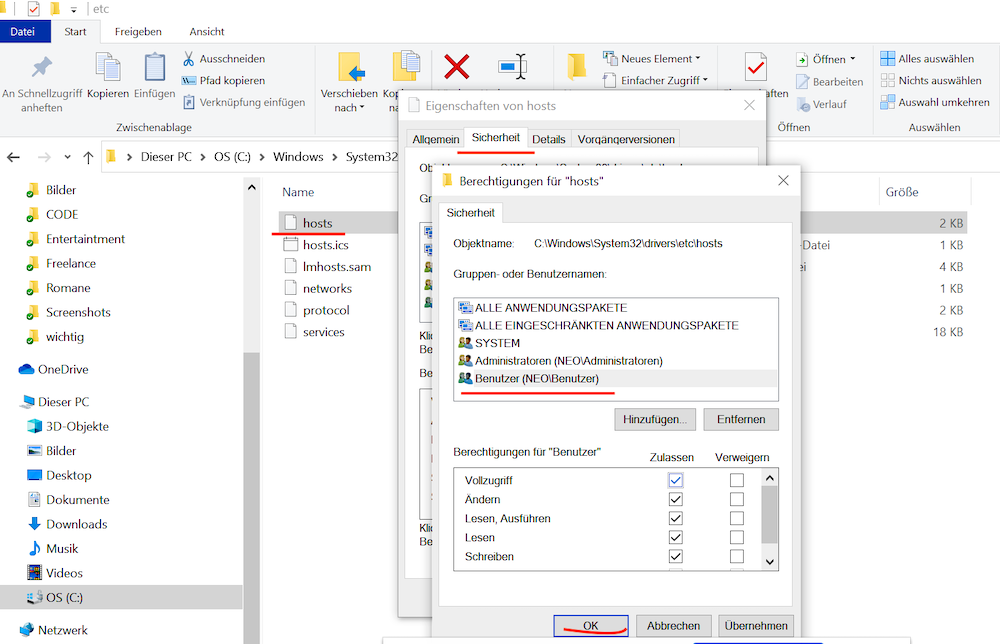

# bta-movies-start
## Einrichtung eines Virtuellen Host namens: bta-movies-start.loc

Für Arbeiten an Konfigurations-Dateien unbedingt Text-Editoren benutzen, die Zeilennummern anzeigen.
Unter Windows z.B TextPad: 
https://www.textpad.com/de/download 

#### Für Windows DNS in host Datei eintragen (C:\Window\System32\drivers\etc\hosts)
#### Für Mac OSX, Linux DNS in host Datei eintragen (/etc/hosts)
- 127.0.0.1	bta-movies-start.loc

Zugriffsrechte unter Windows setzen


#### Apache -> httpd-vhosts.conf
- Windows: C:\xampp\apache\conf\extra\httpd-vhosts.conf
```
<VirtualHost *:80>
	ServerName localhost
	DocumentRoot "/xampp/htdocs"
</VirtualHost>
<VirtualHost *:80>
	ServerName bta-movies-start.loc
	DocumentRoot "/xampp/htdocs/bta-movies-start"
	CustomLog "logs/access_bta-movies-start.log" common
	ErrorLog "logs/error_bta-movies-start.log"
</VirtualHost>
```
- Mac OSX: /Applications/XAMPP/etc/extra/httpd-vhosts.conf
```
<VirtualHost *:80>
    ServerName localhost
    DocumentRoot "/Applications/XAMPP/xamppfiles/htdocs"
</VirtualHost>
<VirtualHost *:80>
    ServerName bta-movies-start.loc
    DocumentRoot "/Applications/XAMPP/xamppfiles/htdocs/bta-movies-start"
    ErrorLog "logs/bta-movies-start-error_log"
    CustomLog "logs/bta-movies-start-access_log" common
</VirtualHost>
```
#### Apache -> httpd.conf überprüfen
- Windows: C:\xampp\apache\conf\httpd.conf
- Mac OSX: /Applications/XAMPP/etc/httpd.conf

In der zentralen Konfigurations-Datei des Apache-Servers 'httpd.conf' bitte überprüfen,
ob dort die httpd-vhosts.conf inkludiert wird. Folgende Zeile muß dort eingetragen sein:
```
Include etc/extra/httpd-vhosts.conf
```
Falls diese Zeile dort existiert und ein Rautezeichen (Zeichen für Kommentar-Zeile) davor steht, 
dann entfernt es bitte. 
Nach diesen Anpassungen unbedingt den Apache-Server neu starten.

#### MVC Design Pattern als Grundlage der Projekt Struktur
- M: Model = Datenmodell, Funktionalitäten der Datenhaltung (CRUD - Aktionen: Create, Read, Update, Delete).
Betrifft die notwendigen DB-Funktionalitäten
- V: View = Präsentation, die Anzeige Logik (HTML, CSS, Javascript). Implementierung der Daten per PHP.
- C: Controller = Steuerung, Die spezielle Logik zur Behandlung aller Requests per URL-Parameter (Routing)
Siehe auch: https://de.wikipedia.org/wiki/Model_View_Controller

#### Routing
Implementierung der Controller-Aktionen entsprechend der vorgegebener URL Parameter per GET-Requests.
Die GET-Parameter werden von uns definiert und zu Suchmaschinen-freundlichen URL's gemappt.
Es gibt folgende GET-Parameter:
- controller
- action
- id (optional)
Beispiele: 
- aus bta-movies-start.loc/?controller=authors&action=index wird: bta-movies-start.loc/authors
- aus bta-movies-start.loc/?controller=authors&action=edit&id=1 wird: bta-movies-start.loc/authors/edit/1

Das gesamte Routing wird in index.php implementiert. Eine bestimmte Route 
(z.B: bta-movies-start/authors) instanziert einen bestimmten Controller und führt eine für diese Route vorgesehene Aktion (Controller Methode)
aus. Beispiel: bta-movies-start/authors => AuthorController::index()

#### Daten (Model) und Views
Die Controller inkludieren per require_once die vorgesehenen View-Files
und liefern ihnen über Model-Funktionen die notwendigen Daten per PHP-Variablen.


